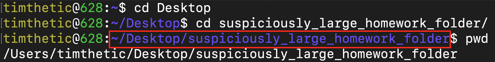

# Hackschool Session 2: Introduction to Backend Development
**Location**: Boelter 5249, UCLA

**Time**: 6-8pm

**Teacher**
* Timothy Rediehs

## Resources

**Slides**
* [Session 2 - Introduction to Backend Development](https://www.tinyurl.com/hackschool2019-s)

**ACM Membership Attendance Portal**
* [Portal](http://members.uclaacm.com/login)

**Install Node.js**
* [Install Node.js](https://nodejs.org/en/download/)

## What we'll be learning today
* What is a Server?
* Basic JavaScript
* Command Line
* Node.js
* NPM + Express

## Goal of today
* Create your own server using node.js

## Servers

A server is a computer that *serves* content to other various devices (which we call clients).  It is important to note that, usually, the server and the client are different computers.  However, during our development, your computer will be both the server and the client!

## JavaScript
Open Console in your Chrome Browser Developer's Tool:
* <strong>Right</strong> click on anywhere on a webpage
* Click `Inspect`
* Click `Console`

Write a line of code, which are just instructions to the computer. JavaScript is executed line by line, once you hit enter. Chrome will execute your code.

### 1. Values

Every programming language has the ability to store a value, like a number, or a "string" (a sequence of characters surrounded by quotes).

```js
3
'Galen'
```

Programming languages like JavaScript also allow us to manipulate values, like adding and multiplying numbers or "concatenating"/joining strings together.

```js
3 + 3
3.14 * 3 * 3
'Galen ' + 'Wong'
```


### 2. Variables

Eventually, values can get too complicated to type out every single time we need to use that value. Imagine the constant *π*: not everyone can remember more than a few digits of *π*. It's easier to give this value a name.

Here's where "variables" come in. They are basically names for values that we can refer to. In JavaScript, each variable is **assigned** a value.

We can think of a variable as a box with a name tag that contains some value.

Let's create/__declare__ a variable called age.
```JS
let age;
// Note: the semicolon (;) is not a must in JavaScript.
// It is just nice to have for consistency.
```

We can assign a value to it with an equal sign (`=`). Then print it out in the console with `console.log(age)`.
```JS
age = 9;
console.log(age);
```

We can then overwrite/change its value by assigning another value to it.
```JS
age = 10;
console.log(age);
```

We can declare a variable and assign a value to it at the same time.
```JS
let x = 5;
```
Now we have a variable named `x` and has the value of 5.

We can do some math with variables.
```JS
console.log(x + 2)
// 7
```

If you never reassign your variable, you can use `const` to declare the variable to make it a constant.

```JS
const thisMustBeOne = 1;
const pi = 3.1415926535897932;
```

If you try to change it, the browser will throw an error.

```JS
thisMustBeOne = 2;
// Uncaught TypeError: Assignment to constant variable.
pi = pi * 2;
// Uncaught TypeError: Assignment to constant variable.
```


> Side note: the "lowerCaseUpperCase" naming convention is used by a lot of programmers. (Technically called "Camel Case.") Some people also like using the snake\_case naming method instead, though it's more rarely seen with JavaScript.

Variable can also be strings, which are a bunch of characters in quotes.

```JS
let name = 'Kristie';
console.log(name);
```

> For folks with experience in some other programming language, there is no need to specify the type of a variable in JavaScript. Any variable can contain a value of any type.

In JavaScript, we can use single quotes or double quotes. Both are valid. For consistency, we'll be using single quotes moving forward.
```JS
name = 'Galena';
```

You can "add" strings together. This is called __concatenation__, meaning joining two things together.
```JS
console.log('Hello ' + name);
// Hello Galena
```

#### Exercise: What are the outputs?

Case 1
```JS
const num = 1;
console.log(num + num);
```
Case 2
```JS
const str = '1';
console.log(str + str);
```

Answer:
* Case 1: **`2`**. We are adding a number to another number, so 2 is the result.
* Case 2: **`11`**. Note, the `'1'` here is surrounded by quotes, which makes it a string. When one adds a string to another string, they are concatenated.

### 3. Functions
Beside numbers and strings, JavaScript also has another type of values called **functions.** Just like any other value, you can assign functions to variables.

A function is something that performs some action and optionally returns a value.

Syntax of function in JavaScript looks like this.
```JS
// Syntax 1
const functionName = (input1, input2) => {
  // actions and statements...
};

// Syntax 2
function functionName(input1, input2) {
  // actions and statements...
}
```

For this workshop, we will be using syntax 1.

Let's write a function called "plus" that adds or concatenates two values together.
```JS
const plus = (x, y) => {
  return x + y;
};
```
To call/use the function,
```JS
plus(5, 2);
```
This does not do anything since you are not "remembering" the value returned from a function.

We can "save" the returned value with a variable.
```JS
const s = plus(5, 2);
console.log(s);
// 7
```

Inputs are called "parameters" or "arguments".


We can also have function without input parameters
```JS
const saySomething = () => {
  return "I'm giving up on you";
};
```

We can also have a function that returns nothing.
```JS
const saySomething2 = () => {
  console.log("I'm giving up on you");
  // no return statement
};
```

We can have as much statements in function as we please.
```JS
const printNoot = () => {
  console.log('noot');
  console.log('noot noot');
  console.log('noot noot noot');
};
```

We can even call other functions within some function
```JS
const double = (x) => {
  return plus(x, x);
};
```

### 4. Objects
Objects in JavaScript are collection of data. Each piece of data has a "key" and a "value".

Let's make an object called `person` and they go to school at UCLA.

Here is the syntax.

```JS
let person = {
  age: 18, // notice the comma
  school: 'UCLA'
};
```

Here the `age` is the key, while `18` is the value. Each pair is also known as a **property** of the `person` object.

To get the value of a property, we can put a dot between the object variable and the property key: `person.age` will give us 18, while `person.school` will give us `'UCLA'`.

Objects can hold different types of data.

We can even add more data to it…
```JS
person.birthday = '17 Aug, 1948';
person['name'] = 'Gene Block'; // alternative syntax, notice the quote
```

… or change existing properties …
```JS
person.age = 71;
```

We can put functions into objects as properties as well.
```JS
person.shout = () => {
  console.log("AAAAHHHHHHHHH!");
};
```

We can tell Gene Block to shout by calling the `shout` function like this.
```JS
person.shout()
// AAAAHHHHHHHHH!
```

## CLI (Command Line Interface)

### GUI vs CLI
GUI stands for __Graphical User Interface__. GUI are nice because they have nice buttons and images for you to intuitively interact with your computer. Most applications we use these days are GUIs: Chrome, Sublime, Microsoft Word are all examples of such GUIs.

CLI, on the other hand, allows you to interact with computer with text only: the application only responds to whatever you typed.


### Terminal
The terminal provides us with a way to interact with CLI applications.

On Mac, goes to spotlight search (<kbd>Command</kbd>+<kbd>Space</kbd>) and type "terminal" and hit <kbd>Enter</kbd>.

On Windows, hit and Windows key and type "powershell" and hit `Enter`.

When you first enter, you are in your "home directory." This is the current directory/folder that you are working with.

To see the directory/folder that you are currently in. Use the `pwd` command. `pwd` stands for "print working directory".

```bash
$ pwd
# output: /User/timthetic
```

You might notice that, in the terminal prompt that appears to the left of what you type, your computer may already display an abbreviated "working directory" above. Most of the time, you don't have to use `pwd`, but it's a useful tool to know.



> The `$` in front of lines means that what comes _after_ the `$` is what you should type. The lines that start with `#` are ones you don't type, but rather tell you what happens.

> The sample output here is all created on a macOS system. If you are not using a Mac then the output could be very different – but that's okay.

If you are in a folder, you should be able to see what is in your current folder/directory. Use `ls` command, which stands for "list".
```bash
$ ls
# output: Desktop Document file.txt
```

You should also be able to go to another folder. Let's say I want to go to my `Desktop` folder that is in my current directory. Use `cd` command, which stands for "change directory", followed by the name of the directory.
```bash
$ cd Desktop
```
Now type `pwd` again. You should see some thing like
```bash
$ pwd
# output: /user/galenw/Desktop/
```

`pwd`, `ls`, and `cd` are all commands that you tell the computer. That's why it is called COMMAND line interface.

## Node.js

### What is Node.js?
Node.js is a JavaScript runtime environment. It basically allows you to run JavaScript on your local computer instead of inside a browser.

### Example: Explore node
If you have installed node correctly, run `node -v` in terminal.
```bash
$ node -v
```

It should output the version of the currently installed Node.js, like `v12.7.0`.

Since you have already installed Node.js, your CLI should now have a new command called `node` (just as `ls`, `cd`, which are all commands that can be called from the terminal)
```bash
$ node
>
```

Write JavaScript as you would do in a browser.
```JavaScript
let x = 1;
console.log(x + 1);
```

Type <kbd>Ctrl</kbd>+<kbd>C</kbd> twice **or** <kbd>Ctrl</kbd>+<kbd>D</kbd> once to exit.


### Example: Using a file (`node sum.js`)
We create a folder on Desktop called `hackschool-2` and create a file named `sum.js` inside.

In `sum.js`,
```JS
const sum = (x, y) => {
  return x + y;
};

console.log(sum(1, 2));
```

Now, we navigate to the directory/folder containing `sum.js`. Use `ls` to check if it is there.

```bash
$ cd Desktop/hackschool-2
$ ls
sum.js
```

Instead of typing our code out, we can use `node` to run our JavaScript file instead.
```bash
$ node sum.js
```
`node` keyword evokes the node program. We tell the node program which JavaScript file to process, in this case `sum.js`.

Output "3" as expected.


### Your own server! (Express)

Web server software are very complicated creatures that require several upper-division CS classes to explain fully. However, in Node.js, __other people has already written the code__ necessary to start a server for you!

Node.js has the concept of __packages__ (also known as __modules__), which are code bundled together to do one thing really well.

For Web servers, a group of people has already written a package called __Express__, which we can use to start our own server in just a few lines.

How to we use their package then?

### npm (Node package Mangager)
npm is the program that allows you to download the packages people published online.

You do not have to install it separately since it is by default installed along with Node.js.

First `cd` to the directory with the `sum.js` file. You should already be there if you did nothing else to your terminal. This will be where are we put our server code.

Run the following command.
```bash
npm init
```

It will then ask you about name of package, version, description and other info. We can just let the program set the default by pressing enter.

```
package name: (hackschool2)
version: (1.0.0)
description:
entry point: (index.js)
test command:
git repository:
keywords:
author:
license: (ISC)
```

The `npm init` command creates a `package.json` file. This file is going to keep track of all the packages we have installed.

We could have just typed out the entire `package.json` without using `npm init`. But why do that if we have a tool that creates it for us?

`json` stands a JavaScript Object Notation. `package.json` file is basically a JavaScript object, stored in a file.

Now, let's download the `express` package.
```
$ npm install --save express
```

If we open `package.json`, we see that the file has changed.
```
"dependencies": {
  "express": "^4.16.4"
}
```

This indicates that we have downloaded the `express` package.

Notice also, we now have an extra folder called `node_modules`. This is where the downloaded packages sits.

Another file that is created is `package-lock.json`. If your downloaded package also uses some other packages, `package-lock.json` will keep track of the other packages as well. However, this `package-lock.json` is not required for npm to work. It just makes things faster when you install packages in the future.

### Server Code
Now, we start a file named `index.js`. Remember, we want to use the `express` package. So, the first thing we tell JavaScript is that we want to use `express`.
```JS
const express = require('express');
```
* `require` is a function that takes in a package name and returns what's in it for you.
* What is being returned by the `require` function depends on how the author of the package wrote it. It can be a number, a string, or even a function. In this case, the `express` variable holds a function.

> _Q: What is the difference between `npm install` and `require`?_
>
> A: `npm` downloads the package from the Internet and put it in local files. `require()` actually runs the code inside the package.

----

We then create an Express web app by calling the `express` function.

```JS
const express = require('express');
const app = express();
```
Now, the `express` function returns an object with some properties. We name that object `app`.

### Detour: A bit about URLs
A URL looks like this
```
https://www.example.com/user/Galen
```
* `www.example.com` will be translated to the IP address of the server.
* `/user/Galen` specifies which page in the webpage you are trying to access. This is called an endpoint.

### First page
Let's say we want to build a website `www.mypage.com`. We want our first page to be `http://www.mypage.com/`.

We first create an HTML file, calling it `index.html`:

```html
<!DOCTYPE html>
<html>
<head>
    <title>Hello World</title>
</head>
<body>
    <h1> Hello, this is my first server. </h1>
</body>
</html>
```

Then, in our `index.js` file, append

```JS
app.get('/', (request, response) => {
  response.sendFile(__dirname + '/index.html');
});

app.listen(3000)
```

The `app` object we created earlier has a function called `get`.  You can think of `app.get` as "if the user ‘gets’ something from the ‘app’, then execute our function"

The first input to `get` specifies which page the user wants to get.

We passed in a function as the second input, which is called when a user is accessing the page.

Express then passes the 2 objects, `request` and `response` to our function, whenever someone makes a request.
* `request` is the thing coming from the browser.
* `response` is what goes back to the browser.

The `response` object provides some function that allows us to send response. One of them is `sendFile`, which allows us to send a file – verbatim – to the browser.

Note: `__dirname` is the directory name of this server file we are editing right now. It is also whatever that is printed by the `pwd` command. We passed the path to our HTML file and it will be sent to the user whenever they are trying to access to page.

Let's type in http://localhost:3000/ in our browser in see what happens. By long-standing tradition, the special domain name `localhost` always refers to the current computer's IP address. When we do this, we're using our laptop as both a server and a client. Remember that we don't put our server code in Arizona while we're developing.

**We get our page!!!!!!!!**

What happens if we try accessing "other page", like http://localhost:3000/user/Galen?

We get an error, becuase there is no such page! Remember, we only defined the URL endpoint `/` with `app.get('/', …)`.

We can change the string we are passing to `app.get()`, so that it now responds to `/mypage`.

```JS
app.get('/mypage', (request, response) => {
  response.sendFile(__dirname + '/index.html');
});
```

Now we can see our page at http://localhost:3000/mypage.

However, http://localhost:3000/ returns an error, since we did not specify what to show there.

### Random number generator

For now, our server only serves a local HTML file that doesn't change. The true power of backend development comes when we create a page that can change dynamically.

```JS
app.get('/random', (request, response) => {
  response.send('<!DOCTYPE html><html><body>Your random number is: ' + Math.random() + '</body></html>');
});
```

Now, when one visits http://localhost:3000/random, they should receive their very own random number.

### Ports

You must be wondering, what does `app.listen(3000)` do?

When this line is executed, we set up the server in our computer, and start listening at the __port__ `3000`. But what is a port?

Let's say you want to host 2 webpages on your computer at the same time. But your computer only has one IP address.

So, people invented this concept called "port", which means there are multiple "entry points" on your computer/server. For example, Kristie's website could be served via port 3000, while Timothy and Galen's could be on port 8080.

Try changing `app.listen(3000)` to `app.listen(8080)`. Now, we can only access our page at http://localhost:8080/mypage.

# ⭐️ Back-end Session 1 Mini-project ⭐️
## Main Idea
We want to write a new endpoint that takes a `get` request at the endpoint `/animal` (the full URL will be `localhost:3000/animal`) and send back the following:
```html
'<!DOCTYPE html><html><body>Your random animal is: [some random animal]</body></html>'
```
## Tasks
* Create an array of animals and fill it with animals as strings (like `'dog'`).  
* We used the `Math.random()` function previously.  Create a function called `randomInt` that takes one parameter called `max`.  The function should return a random integer between 0 and max *not including max*.
    * You will find `Math.floor` useful for this
* Create an endpoint that takes a get request at `/animal` and returns a page with a random animal from your list
