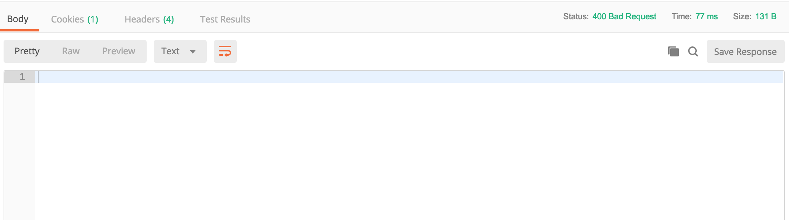
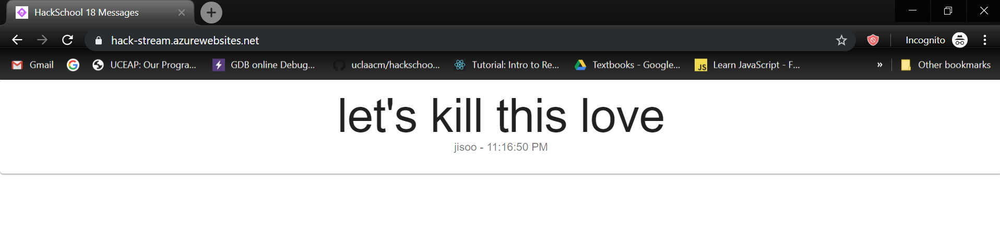

# Hackschool Session 3 Backend: What is an API?
**Location**: Boelter Hall 5249

**Time**: 7:00-8:00pm

**Teachers**
* Jody Lin

## Resources

**Slides** 
* [Session 3 - API, HTTP, and JSON](https://docs.google.com/presentation/d/1jZdNj7ELvJaXlLmeEWr9JlG-YLf5gafUeAkVrn0XUpw/edit?usp=sharing)

**ACM Membership Attendance Portal**
* [Portal](http://members.uclaacm.com/login)

**Install Postman**
* [Install Postman](https://www.getpostman.com/)


## What we'll be learning today
* What is HTTP?
* HTTP Methods
* What is JSON?
* What is an API?

## Goal of Today
* Understand how our computers (clients) get data from servers
* Create your own API in node.js


## What is HTTP?

Previously, we talked about typing a URL into the browser. In our demo from last week, we created our own server on our computer. When we made a request for the page through our URL, our server (on our computer) responded by returning back an HTML page that we coded. 

As far we've learned, a client computer can request for data through a URL and a server will respond back with the information we asked for (like an HTML page).

However, is that all the client and server can do? 

Consider the following scenario: 

### The God of Memes
It's week 4 and midterms are coming up. You're stressed and decide to make a meme about how stressed you are instead of studying. 


You get your hot meme image ready to post it on Facebook.

You click Post. 

Now, your image is being uploaded to a server. Our sick meme will now get uploaded and people will be able to see it online they request to see the meme page. 

Wait, but this time we didn't just request to *get* a meme from the server, we actually *posted* a meme. 

So apart from the client requesting to **get** data from the server, it can also request to **upload** data to the server!

So with this understanding, we know that a client can request to:
1. Get data (ex: html page)
2. Post or upload data (ex: post a meme)

The server will then send the appropriate response to our request.

But how does the server know whether our computer know whether we're trying to get data or post something?

This is where __HTTP__ gets into the picture. 

### HTTP format
HTTP stands for __Hypertext Transfer Protocol__.

Not so long ago (in 1991), a couple of very smart people defined a way clients and servers should communicate. This is known as __HTTP__. 

In simple terms, HTTP protocol defines how the request from the client should be formatted, and also how the response from the server should be formatted. We can call these HTTP messages (messages sent between our computer and the server).

An example of a request message may look like this:
``` http
GET / HTTP/1.1
Host: www.example.com
```

An example of a response message may look like this: 
```http
HTTP/1.1 200 OK
Date: Mon, 23 May 2005 22:38:34 GMT
Content-Type: text/html; charset=UTF-8
Content-Length: 138
Last-Modified: Wed, 08 Jan 2003 23:11:55 GMT
Server: Apache/1.3.3.7 (Unix) (Red-Hat/Linux)
ETag: "3f80f-1b6-3e1cb03b"
Accept-Ranges: bytes
Connection: close

<html>
  <head>
    <title>An Example Page</title>
  </head>
  <body>
    <p>Hello World, this is a very simple HTML document.</p>
  </body>
</html>
```

HTTP messages are just strings are sent between the client and server. The rules set by HTTP allow the server to interpret the string to understand what user wants and vice versa.


An HTTP message is usually comprised of two parts: the __header__ and the __body__. These will be separated by a newline (you can see this in the response example above).

### 1. Header
A header is piece of text (string) that contains general information about the message, such as the type of request made (GET/POST/etc), or the the status of the response.

### 2. Body
This contains any data associated with the request or response. If you are uploading images or text, for example, the body will contain all the data about the image or text. The body of an HTTP response would also contain data being sent to the client.

We can actually see these messages inside the developer console in Chrome.

* Right click on any page, then click `Inspect`. Or just <kbd>Command Option i</kbd> on Mac, <kbd>Ctrl Shift J</kbd> on Windows.

* Open the network tab in the Chrome DevTools.

* Go to `www.google.com`

* Click on the `www.google.com` in the column labeled Name.

* Go to the `Headers` tab

You can see the Request and Response Headers!

It has information about `path`, which specifies which page you want from `www.google.com`.


## HTTP Request Methods
Let's go into more detail now and look at HTTP Requests. How do differentiate a request to get data from a request to upload data? 

One easy way for the server to know whether the client wants to get webpage or to upload a file is through the property `method` in the request header.

Different methods tell our server what exactly we want them to do. Some of these include GET, POST, DELETE, TRACE, etc. Today we will cover the 2 basic ones: GET and POST. 

### GET
A `GET` method is used when we want to retrieve or *get* data from a server.
```http
GET / HTTP/1.1
Host: www.example.com
```
Here is an example of a `GET` method being used in an HTTP Request. We are trying to `GET` the webpage *www.example.com*. By specifying `GET` in the `method` key in the header, the server will send you back the HTML file.

Notice our `GET` request only contains a header and no body. This is because we are only requesting to get data, so our body contains no data. 

So when you type in a URL, the browser will format a request to the server for you. Then it will send the request.

### POST
A `POST` method is used usually when we try to upload something, like text or a file.
```http
POST /cgi-bin/process.cgi HTTP/1.1
User-Agent: Mozilla/4.0 (compatible; MSIE5.01; Windows NT)
Host: www.example.com
Content-Type: application/x-www-form-urlencoded
Content-Length: length
Accept-Language: en-us
Accept-Encoding: gzip, deflate
Connection: Keep-Alive

licenseID=string&content=string&/paramsXML=string
```

But how do we send a request with a `POST` method? We can't just type in a URL in the browser, since there would be no way for us specify the file/text that we want to upload.

`POST` requests are usually done under the hood for you by JavaScript. 


## HTTP Responses

After a client makes a request to the server, the server is going to process the request and the send a response back. This response is going to be formatted the same as our requests are with a Header and a Body. They will contain slightly different information though. 

### Header

This will contain some general information about the response. One of these important pieces of information is the *Status Code*. 

You have probably seen the infamous Error 404 page.


404 is actually a status code!

#### HTTP Status Code

In the `header`, there is a field called `status` containing a number. That number indicates if your request was successful.

```
2XX: The request was successful
4XX: The request was not successful and client probably messed up.
5XX: The request was not successful and server probably messed up.
```

So if you've ever seen Error 404, this means you've made a bad request to the server (like accessing a page that doesn't exist).

### Body

In the `body`, it will contain whatever data is sent back. The data can be JSON/HTML, a random string of text, or even nothing at all. This is simply the data that the server is sending back to the client. 


Let's check the Chrome developer console and go to `www.google.com`.

* We can find `status` in the `Response Header` tab under the `Header` section.
* We can also see the `Response` tab to see what is contained in the body.
* The `Preview` tab provides a prettier view of the `body` data.


## What is JSON?

Sometimes the data we want to pass in our body is not necessarily an HTML file. What if we simply wanted to pass a collection of data, like a person's name, age, and favorite food? We don't want to display this data as HTML, perhaps we simply want to pass this information to our server to be stored in a profile. 

We can use JSON!

JSON is __JavaScript Object Notation__. We represent data in the JSON format, as we would in JavaScript. IT looks something like this:
```js
{
    "name": "Jody",
    "age": 19,
    "favoriteFood": "sushi"
}
```
So data in the body of a request or a response could be sent as a JSON! 

Now, an interesting thing is that not only can we request to `GET` a HTML page from the server,
we can also `GET` data from the server in form of JSON. 

Let's try it out.

Here is an URL that we can use to `GET` some cat facts. 

```
cat-fact.herokuapp.com/facts/random
```
It returns a JSON!

## Postman

We know that we make GET requests all the time through URLs in our browsers. But how about POST requests? 

At this point in time, we have not learned how to actually code a POST request. But wouldn't it be great if we had a tool where we could write the body of our POST request, hit a button, and make a POST request to an actual website?

This is where __Postman__ comes in handy! A bunch of really smart people realized the need to test HTTP requests and created a program that allows us to easily make all different types of HTTP Requests with the push of a button. We will also be able to see the HTTP Response sent back as well!

## Making a GET Request
Just as we can make a GET request through the browser, we can make one in Postman!

Open Postman and make sure the type of request is GET. 

Type https://hack.uclaacm.com/ into the request URL and hit SEND. 

We should now see the HTML returned to us! There should also be a `Status Code: 200` which means that our GET request was successful!

We can also preview the HTML using the `preview` tab.


Let's try with the cat fact example again.

```
cat-fact.herokuapp.com/facts/random
```

We should now get a JSON returned to us. 

## Making a Post Request

Let's try making a post request now. Recall that our POST request is going to send data to the server and so we will need to put data into the body of our POST request. 

We will try this out with a simple webpage. In your browser, go to: https://hack-stream.azurewebsites.net/

We get a....BLANK WEB PAGE :D

Okay not too exciting, but we can actually make a POST request to the server and put messages on this page. Then other people will be able to see our messages when they visit the URL. 

Let's try this out. 

Leave the website open in the browser and go back to Postman. 

This website accepts POST requests through an endpoint labeled `/message`. So change our request URL to: https://hack-stream.azurewebsites.net/message

Make sure we also change the type of method to POST. 

Now when we hit SEND we get....

Oof just an Error Code 400. This is because we haven't actually put anything in our body to send to the server. 



To fix this, navigate over to the BODY tab in Postman. We're going to change the type of our Body to `raw`. Then change the dropdown from `TEXT` to `JSON`. We are now ready to write the body of our POST request. 

This website will take in a body with a JSON formatted as such: 
```js
{
    "sender": "jisoo",
    "message": "let's kill this love"
}
```

As we can see, we have 2 required fields `sender` and `message`. One our hack officers has coded this such that these are required. If we don't include them, we will get a response with an error code. 

Notice that Postman automatically sets one property in the header. 

```
Content-Type: application/json
```

`Content-Type` tells the server what is inside our `body`. That way, the server will know how to interpret/understand it. In this case, the server will interpret the body as JSON, or a JavaScript object. 

Now hit SEND.

If we scroll down in POSTMAN, we can see that we were sent back a Response containing a JSON:
```js
{
    "status": "Success!"
}
```

Let's head back over to the website now.

VOILA! Our message is there. 




### What is under the hood in browser?

So when we make posts on websites like Facebook, Twitter, etc, there is code underneath that does exactly what we did in Postman. 
It formats the request header and body, and sends it to the server using the URL.


## What is an API?
API stands for __Application Programming Interface__. An API is a definition of methods of communication among various components. 

What are the differences between an API and HTTP then, or how are they related?
* HTTP defines how computers can talk to each other over the world wide web.
  * HTTP was predefined by some super old but also super smart engineers of the Internet.
* You, the programmer:
  * Get to decide which APIs you use
  * Can define your own APIs
    * "To receive information about a Facebook user, make a GET request to `https://graph.facebook.com/{user-id}`"
* Web APIs rely on HTTP to specify what can and can't be done with specific endpoints/URLs in the API.

It is pretty abstract but don't worry. As you get more and more experienced, you'll gain an intuition for what an API is.

In the web context, an API usually refers to a set of specific endpoints that we can call to retrieve some data. 

For example, the cat facts endpoint is part of an API to retrieve JSON data of, well, cat facts. We __HAVE TO__ use a GET method to make a request to the specific URL. There are restrictions on how we can talk to the server, and therefore, it is part of an API.

Moreover, the URL to POST a message we just did was also a part of an API. We __HAVE TO__ use a POST method to make a request to the specific URL. We also have to make sure we have a JSON object in the body that has the key `sender` and `messsage`. There are rules to how we upload a message, and therefore, it is part of an API.


## Write your own API

Setup:
* Make a folder
* npm init
* install express
* Start a server. 

```bash
$ pwd
/Users/AsuS/Desktop
$ mkdir myAPIserver
$ cd myAPIserver
$ npm init
# ...
$ npm install --save express
# ...
$ touch server.js
```

Inside `server.js`

```JS
const express = require('express');
const app = express();
```

Let's make an endpoint to return some random numbers in JSON. 

```JS
app.get('/random', function (request, response) {
    const myJSON = {
        number: Math.random()
    };
    // myJSON at this point should look like this
    // { "number": 123 }
    response.json(myJSON);
});

app.listen(3000);
console.log("Yay our server is running! Access it through localhost:3000");
```
* the `response.json` function allows us to pass in an object and express will send it back to the user.
* `Math.random` is a built in function to generate a random number.


We do a `GET` to `localhost:3000/random` in Postman.

However, what happens when we do a `POST` on that URL?

We get a 404 Not Found. The reason is that we only defined what will happens when a `GET` request is made to the endpoint with the `app.get` function, not a `POST` request.


Let us write an endpoint that receives something from the user. 
Since user would be 'uploading' some data, we use the `POST` method with the `app.post` function.

```JS
app.use(express.json());
```
This line tells express that the input body might contain JSON object. If express sees a string that is in JSON format in `body` it will transform it into an actaul JavaScript Object.

```JS
app.use(express.json());
app.post('/name', function (request, response) {
    const body = request.body;
    if (body.name === undefined ) {
        response.status(400);
        const wrong = {
            message: "Input JSON does not contain key 'name'"
        };
        response.json(wrong);
        return;
    }
    else {
        const sayHi = "Hello " + body.name;
        console.log(sayHi);
        const resJSON = {
            message: sayHi
        };
        response.json(resJSON);
    }
});

app.listen(3000);
console.log("Yay our server is running! Access it through localhost:3000");
```
* `app.post` specifies that this endpoint takes a `POST` request.
* `request.body` contains the JSON in the `body` of the **req**uest.
* We used a if-statement to check if the `name` key exists in the body.
* If not, we return a JSON saying the input is invalid with status code 400.
* `response.status` helps us to set the `status` in the response header.
* If it does contain `name`, we return a message saying hello. 


Let's test it with Postman.
* Put `localhost:3000/name`
* Select `POST` next the URL field
* Choose the `body` tab  
* Select `raw` and choose `JSON (application/json)`
* Type the following
```JS
{
	"name": "Jody"
}
```

What if we put some other fields in? Like
```JS
{
    "name": "Jody",
    "age": 75
}
```
We still get the correct behavior since we did not check for if the JSON contains extra fields.

What if we remove the `name` key?
```JS
{
    "age": 75
}
```

Now we get an error with status code `400`!

You have just written your first API!

## Your Task
1. Create another API endpoint called randomFact that will return a random fact about yourself. Have the server respond with a JSON. You can decide how to randomize this fact. This will be a GET request.

<details>
<summary>Hint</summary>
Look up arrays in JavaScript and find a way to randomly select an element from the array.
</details>

2. Create another API endpoint called `dog` that will return an HTML page with a picture of a dog. You will have to put the HTML in another file separate from `index.js`. You may use this HTML if you want:
```html
<!DOCTYPE html>
<html>
	<head></head>
	<body>
		
	</body>
</html>

```
Refer back to last week's README to see how we can send back an HTML file as a response. 

3. Create a POST request that will take that has a JSON body formatted like this:
```js
{
    "name": "yeji",
    "comment": "i see that i'm icy"
}
```
Have our response return an error with a status code of 400 if neither `name` nor `comment` are not found in the body. Return an error message as a JSON. 

If both are present, console.log both of them and send a JSON back with a comment in the form:
```
"message" : "(name) said (comment)"
```


