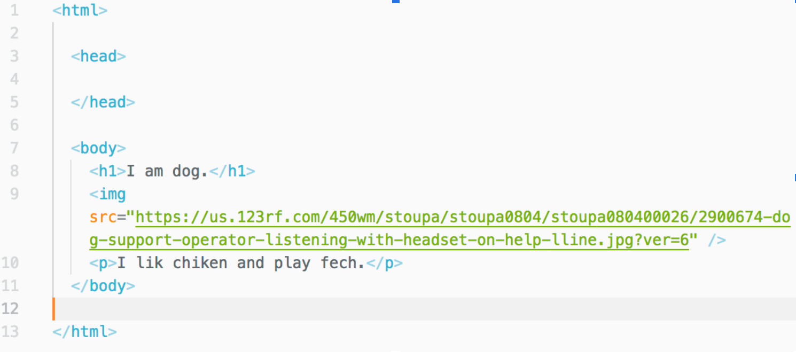
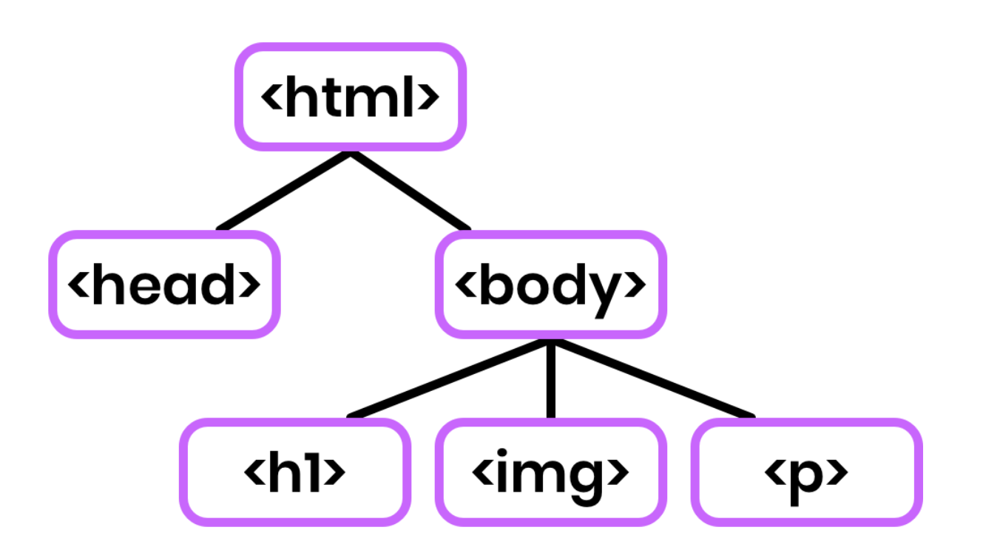
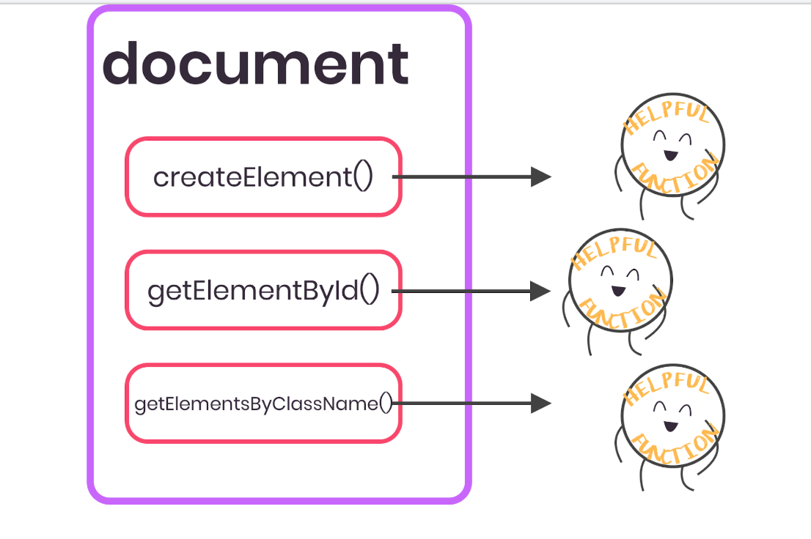
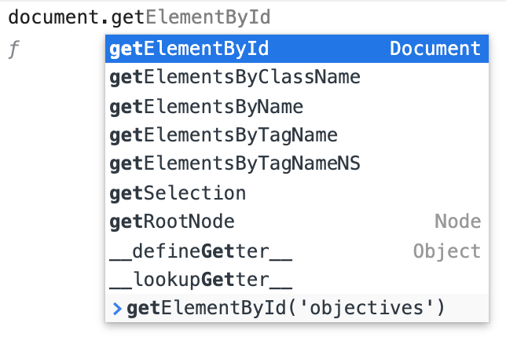

# Hackschool Session 2: Introduction to Backend Development

**Location**: Boelter 5249, UCLA

**Time**: 6-7pm

**Teacher**

- Kristie Lim

**Slides**

- [Session 1 - Introduction to Web Development](http://tinyurl.com/hackschool19-w2slides)

**ACM Membership Attendance Portal**

- [Portal](http://members.uclaacm.com/login)

**Questions**

- [Ask your question here!](https://github.com/uclaacm/hackschool-f19/issues/new?labels=help%2C+unresolved&template=question.md)

**Other useful resources**

- [Eloquent Javascript](https://eloquentjavascript.net/14_dom.html)
- [MDN](https://developer.mozilla.org/en-US/docs/Web/API/Document_Object_Model/Introduction)

## What we'll be learning today

- [The DOM](#the-dom)
- [Accessing Elements](#accessing-elements)
- [Manipulating the DOM](#manipulating-the-dom)
- [Event Listeners](#event-listeners)

## Goal of today

- Understand how you can use JavaScript to change the DOM

## The DOM

So, "DOM" stands for "Document Object Model" and this is basically a **concept**
(read: not anything concrete, not a specific file, not a certain browser, not
anything like that) that thinks about HTML documents and web pages as a
hierarchy of parent components and child components. Generally, the most
parent-level "component" would be the `<html>` tag, containing two children: a
`<head>` and a `<body>`. Also generally, the `body` component will contain many,
many children.

Something that tripped me up wrapping my head around the DOM was: _"Ok, well_
_what's the alternative then? How is the "DOM" different from the actual HTML_
_page? They look absolutely identical."_

Well, in most cases, they will! But let's take an example (absolutely beautiful)
web page:


This is what the browser returns to us, as the user. It parses a certain HTML
file and generates this output. This is **not** the DOM! This is the web page!

Ok, so then let's take a look at that HTML file!



As you can see, we have a `head` and a `body` and within that body we have a
heading `h1`, an image `img`, and a paragraph `p`. This is a pretty simple web page and the structure of the HTML file is not at all complicated. But this is still **not** the DOM! What's the difference?

Well, let's say that I made a mistake in my HTML file. Whoops! I accidentally
forgot to close my `<p>` tag, oh no! Now my HTML file isn't valid anymore!
But... when I go into Google Chrome, everything's fine! What gives?

This is where the differences between the HTML (the "source code" if you will)
and the DOM start to become apparent. The DOM is the representation the browser,
and ultimately, the user, have of a certain web page. And so, if the browser is
smart and/or kind enough, it will say "Oh, hey, you left out the closing p tag
here, but when I'm making the DOM, I'm pretty sure I knew what you meant so my
DOM is still just gonna have a regular paragraph, cool? 👌" And we say "Yes,
very cool thanks!!" (Don't do this in public, for some reason people are
uncomfortable if you talk to your computer 🤷‍)

The difference in the HTML file and the DOM become absolutely **huge** when you
start getting into JavaScript that renders HTML for you like React or Vue (this
is for another workshop though, one thing at a time!). The HTML file is often
incredibly simple, containing only a single `<div>` named "app" and some meta
information in the `<head>` whereas the DOM will be a fully-functional web app
with headers and sidebars and images of dogs everywhere!

That brings us to \*drum roll\* **the DOM!!!**, at last the elusive creature.



## Accessing Elements

First let's review JavaScript objects:
Objects in JavaScript are collection of data. Each piece of data has a "key" and a "value".

Let's make an object called `person` and they go to school at UCLA.

Here is the syntax.

```JS
let person = {
  age: 18, // notice the comma
  school: 'UCLA'
};
```

Here the `age` is the key, while `18` is the value. Each pair is also known as a **property** of the `person` object.

To get the value of a property, we can put a dot between the object variable and the property key: `person.age` will give us 18, while `person.school` will give us `'UCLA'`.

Objects can hold different types of data.

We can even add more data to it…

```JS
person.birthday = '17 Aug, 1948';
person['name'] = 'Gene Block'; // alternative syntax, notice the quote
```

… or change existing properties …

```JS
person.age = 71;
```

We can put functions into objects as properties as well.

```JS
person.shout = () => {
  console.log("AAAAHHHHHHHHH!");
};
```

We can tell Gene Block to shout by calling the `shout` function like this.

```JS
person.shout()
// AAAAHHHHHHHHH!
```

`document` is an object that comes with many helpful functions that help us access elements.



Let's try them out on the [CS 31 Course Syllabus](http://web.cs.ucla.edu/classes/fall19/cs31/syllabus.html)!

Recall that in the browser console, if we type a variable name and hit enter, the value of the variable will be printed out. The `document` object is provided by the browser.

```js
document;
// DOM tree is printed out

document.getElementById("objectives");
// link element with the id 'objectives'

document.getElementsByTagName("tr");
// HTML collection of tr elements

document.querySelector("#website");
// select elements the same way as CSS selectors
```

Autocomplete gives us some more :


## Manipulating the DOM

Now that we know how to find elements in the DOM using JavaScript, let's manipulate them mwahaha...

```js
// Add HTML inside the tag
const w = document.getElementById("#website");
// Add some HTML to the empty link
w.innerHTML = "bread ";
```

Notice that we use the same object syntax to set the `innerHTML` of an HTML element as we do to set the `age` or a `person` object.

We can also set the style of an element. Anything you can set using CSS, you can also set with JS.

```js
w.style.color = "red";
```

For a collection of elements (not just a single element), use a `for` loop to process each element one by one.

```js
const trCollection = document.querySelector("tr");
for (tr of trCollection) {
  tr.innerHTML = "<h1>let's get this bread</h1>";
}
```

Lastly, we can also add new elements to the DOM.

```js
const divElement = document.createElement("div");
divElement.innerHTML = "<h1>let's obtain this grain</h1>";
w.appendChild(divElement);
```

Wow! So in theory we could actually have just one element in our HTML source and run a bunch of JS that adds more stuff. This is why on most modern websites, if you check out the HTML source code, it's far less than the actual DOM.

## Practice

Find all the `h3` tags on the CS31 Syllabus and replace it with your preferred meme-y string. Then change the `font-style` to `italic`.

## Event Listeners

What makes JavaScript so powerful

# ⭐️ Back-end Session 1 Mini-project ⭐️

## Main Idea

We want to write a new endpoint that takes a `get` request at the endpoint `/animal` (the full URL will be `localhost:3000/animal`) and send back the following:

```html
'<!DOCTYPE html>
<html>
  <body>
    Your random animal is: [some random animal]
  </body>
</html>
'
```

## Tasks

- Create an array of animals and fill it with animals as strings (like `'dog'`).
- We used the `Math.random()` function previously. Create a function called `randomInt` that takes one parameter called `max`. The function should return a random integer between 0 and max _not including max_.
  - You will find `Math.floor` useful for this
- Create an endpoint that takes a get request at `/animal` and returns a page with a random animal from your list
