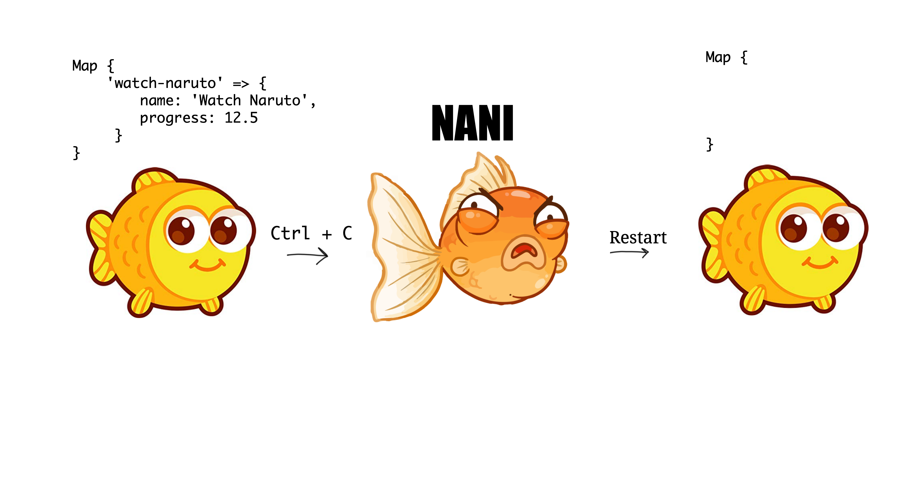
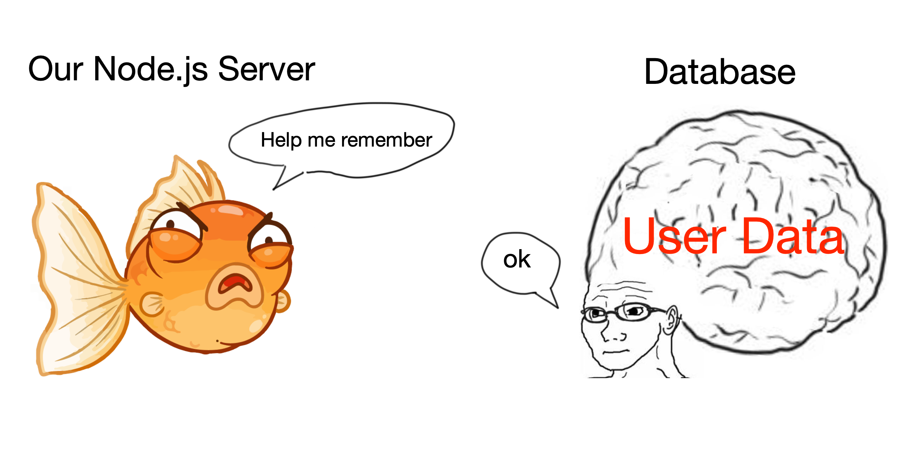
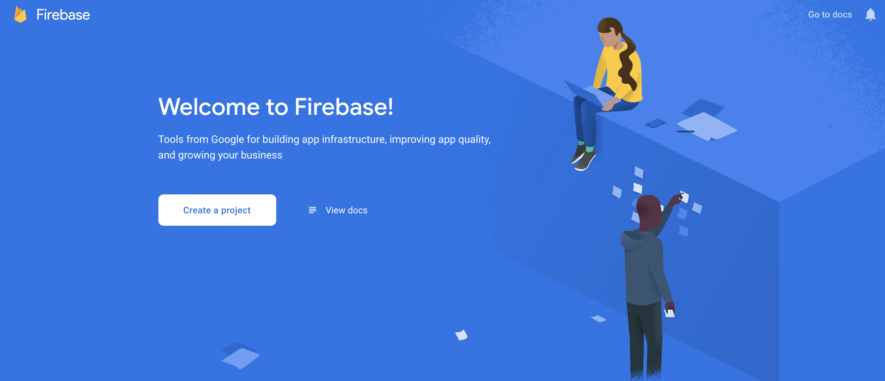
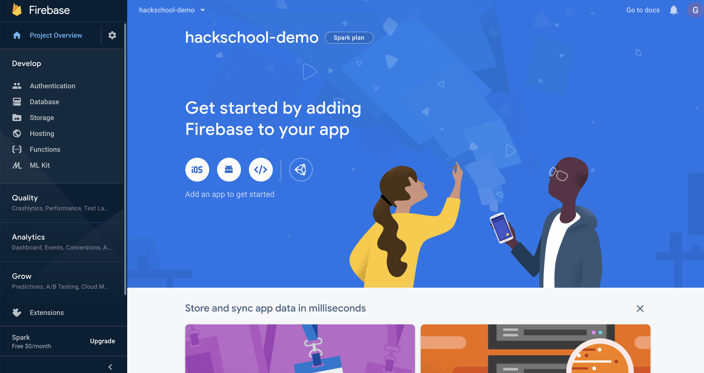
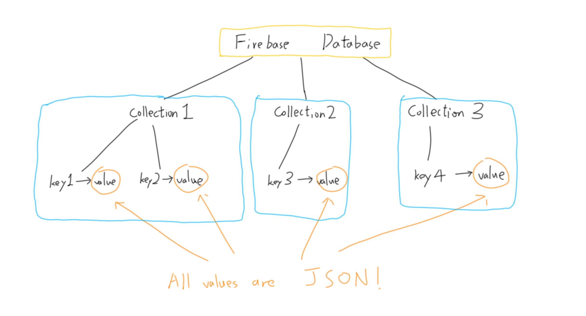
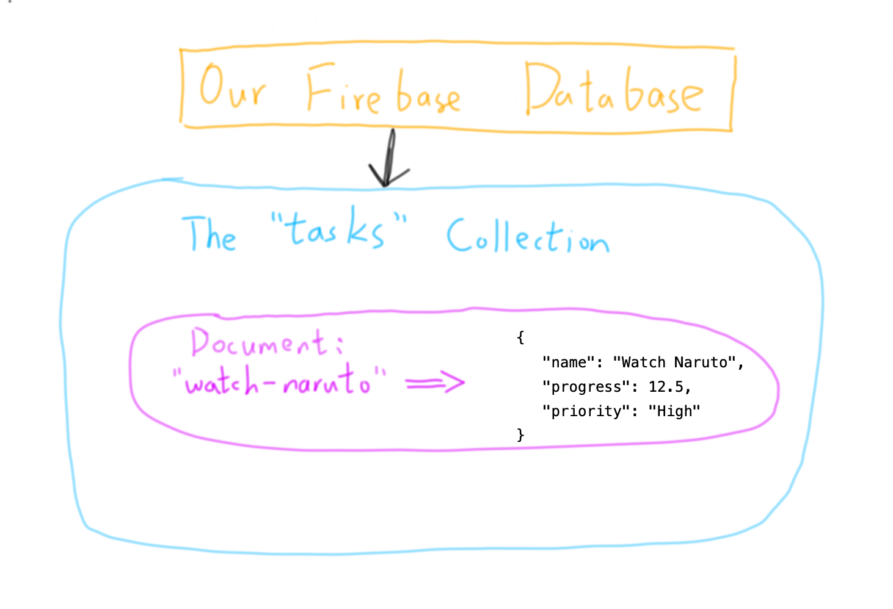

# Hackschool Session 6: Introduction to Database

**Location**: Boelter 5249, UCLA

**Time**: 7-8pm

**Teacher**

- Galen Wong

**Slides**

- [Slides](https://docs.google.com/presentation/d/1RjCwhW5_mFhfwUQ8uzXsJd7VFsbctQH8K9Z1tFhqvEc/edit?usp=sharing)


**ACM Membership Attendance Portal**

- [Portal](http://members.uclaacm.com/login)

**Questions**

- [Ask your question here!](https://github.com/uclaacm/hackschool-f19/issues/new?labels=help%2C+unresolved&template=question.md)


**Other useful resources**

- [Firebase Quick Start](https://firebase.google.com/docs/firestore/quickstart)

## What we'll be learning today
- Server programs are forgetful
- Databases are not forgetful
- Firebase: Google's database on the cloud

## Server Programs Are Forgetful

Let's say you have written a node.js application to keep 
track of your progress on certain tasks. 
We add or change progress through a POST endpoint, and 
access all our progress through a GET endpoint.

Here is the code for it:

```js
const express = require('express');
const app = express();

app.use(express.json());

/* An example task would be:
 *   name: 'Watch Naruto',
 *   progress: 12.5
 * */
const tasks = new Map(); 

app.post('/task', (req, res) => {
    const id = req.body.id;

    const task = {
        name: req.body.name, 
        progress: req.body.progress,
    };
    tasks.set(id, task);
    
    res.status(201);
    res.json({ message: 'Task created' });
});


app.get('/task/:id', (req, res) => {
    const id = req.params.id;
    if (!tasks.has(id)) {
        res.status(404);
        res.json({ message: 'Task does not exists' });
        return;
    }
    
    res.json(tasks.get(id));
});

app.listen(3000);
console.log('Listening on port 3000');
console.log('Press control + c to exit');
```

> Note: do not forget to run `npm init` and `npm install --save express` 
> before you run this server program!

We keep our data to the `tasks` map that we created. 
Remember that a map is just like object, you change
a key-value pair using `myMap.set(key, value)`
and access a value with its key using `myMap.get(key)`.

I send a POST request to the `/task` endpoint with 
the following content in my JSON body.

```json
{
    "id": "watch-naruto",
    "name": "Watch Naruto",
    "progress": 12.5
}
```

Now, my map object should contain the following content.

```
Map { 
    'watch-naruto' => { 
        name: 'Watch Naruto', 
        progress: 12.5 
    } 
}
```

What a nice application! We can also retrieve our 
progress on a certain task using the GET endpoint.
We can send a GET request to `/task/watch-naruto` to
get our progress on watching Naruto.

Everything works beautifully. 
Now, we want to add a new feature. We want to able 
to assign priority to our tasks.

We update our POST endpoint to the following:
```js
app.post('/task', (req, res) => {
    const id = req.body.id;

    const task = {
        name: req.body.name, 
        progress: req.body.progress,
        priority: req.body.priority // added this line
    };
    tasks.set(id, task);
    
    res.status(201);
    res.json({ message: 'Task created' });
});
```

We have just updated our server, and we need to 
terminate it and start it again. We press 
<kbd>ctrl</kbd>+<kbd>c</kbd>, and re-run our server.

But wait, what happens to our `tasks`? 
If I try to get `/task/watch-naruto` again,
I receive the error!

```json
{
    "message": "Task does not exists"
}
```

Our Node.js server has completely forgotten about our 
tasks. Our server program is like a goldfish. 
It cannot remember things. 



In general, any thing you store in variables 
will be lost and forgotten by the program after you
terminate it. 

Where can we store our stuff?
Database comes to the rescue.

## Databases Are Not Forgetful

A database is a system that stores application
data in an organized fashion.
A database makes it easy to access, update, 
and delete our data.

If our Node.js server program has a small brain
like a goldfish,
a database is the one with the big brain.



Most importantly, the database is independent 
from our Node.js server program. Therefore, when 
our Node.js server shuts down, the data in the database
does not get forgotten. They are kept safe in the database.
They are being remembered.

## Firebase: Google's Database on the Cloud

Firebase is a database service provided by Google,
which can be used for free (yay).


### Setting up the Firebase Account

To get your own database on Firebase, we first
need to register a project. Follow the following steps.

1. Go to the Firebase website: https://firebase.google.com/
2. Login with a Google account
3. Click "Go to console" on the top right corner. 
   You should see the following screen

   
4. Now click on "Create a project" and give it a name
5. We do not need to use Google Analytics, so we are going to 
   disable it.
6. After your project is created, you should see the following 
   screen. 

   
7. Go to database in the navigation menu on the right, 
   and select "Create database"
8. Be sure to select "__Start in test mode__", then press "Next"
9. We can use the default location. Click "Done"

    

At this point, your database is already set up!
However, the database is protected. If any other people
try to access it, Firebase will prevent them from doing so.
To actually use it, we need some password so that Google knows 
we are the one actually accessing our database. 
We will need to retrieve the password.

10. Go to project setting, and select the tab "Service accounts"
11. At the bottom, click on "Generate new private key"

    

Now, a JSON file should have been downloaded. 
Remember, __do not share this file with any one else__. 
This file contains the password to your database.

Put this file next to your server `index.js` file. 
This is what your folder should look like now.

```
├── firebase-password.json
├── index.js
├── node_modules
├── package-lock.json
└── package.json
```

### Starting Using Firebase

Now we need to install a library that let us use
firebase easily. 

```
npm install --save firebase-admin
```

To set up our database, we add the following code to our `index.js`,

```js
// import the Firebase library.
const admin = require('firebase-admin');

// import the password.
const databasePassword = require('./firebase-password.json');

// tell the library to connect to the database for us 
// using the given password.
admin.initializeApp({
    credential: admin.credential.cert(databasePassword)
});

// this is our database object.
const db = admin.firestore();
```

### Organization of Firebase 

In a Firebase database, we can have multiple collections. 
Under each collections, we can have multiple documents.

Each document has a unique key that can be used to 
access its value.
Think of each collection as a `Map`. You can access
the documents in that collection using the key.
All the values that can be stored in a document 
are JSON!



### Adding Data to Firebase

Let's rewrite our app to use firebase!
We replace our map with a reference to a collection.

```js
// const tasks = new Map(); 
const tasks = db.collection('tasks');
```

Note that if the collection does not exist in your database,
Firebase will automatically create one for you. 

Then, we modify our POST endpoint.

```js
// note that we changed to using an async function
app.post('/task', async (req, res) => {
    const id = req.body.id;

    const task = {
        name: req.body.name, 
        progress: req.body.progress,
        priority: req.body.priority 
    };

    // changes are here:
    // tasks.set(id, task);
    await tasks.doc(id).set(task);

    res.status(201);
    res.json({ message: 'Task created' });
});
```

Here, `tasks.doc(id)` represents a reference to a document 
with the key being the value of `id`. By calling `set` 
on the document, we are setting the value associated with the key. 
Notice that the `set` function returns a promise. 
We have to await for it to finish to confirm that our task
has been remembered by the database, before we send a response
back to the client confirming that the task is truly created.

### Reading Data from Firebase 

Now we modify our GET endpoint. 

```js
// note that we changed to using an async function
app.get('/task/:id', async (req, res) => {
    const id = req.params.id;
    const taskRef = await tasks.doc(id).get();
    if (!taskRef.exists) {
        res.status(404);
        res.json({ message: 'Task does not exists' });
        return;
    }
    
    res.json(taskRef.data());
});
```

By calling `tasks.doc(id).get()`, we are trying to get the actual
data from the database instead of only having a reference to it.
Again, it returns a promise, therefore we `await`. 

Here is a complete version of our web application.

```js
const express = require('express');
const app = express();

app.use(express.json());

const admin = require('firebase-admin');
const databasePassword = require('./firebase-password.json');

admin.initializeApp({
    credential: admin.credential.cert(databasePassword)
});

// this is our database object.
const db = admin.firestore();

const tasks = db.collection('tasks');

app.post('/task', async (req, res) => {
    const id = req.body.id;

    const task = {
        name: req.body.name, 
        progress: req.body.progress,
        priority: req.body.priority 
    };

    await tasks.doc(id).set(task);

    res.status(201);
    res.json({ message: 'Task created' });
});

app.get('/task/:id', async (req, res) => {
    const id = req.params.id;
    const taskRef = await tasks.doc(id).get();
    if (!taskRef.exists) {
        res.status(404);
        res.json({ message: 'Task does not exists' });
        return;
    }
    
    res.json(taskRef.data());
});

app.listen(3000);
console.log('Listening on port 3000');
console.log('Press control + c to exit');
```

Now, I am going to do the sequence of action again.

1. I send a POST request to `/task` with the following JSON body:
   ```json
   {
      "id": "watch-naruto",
      "name": "Watch Naruto",
      "progress": 12.5,
      "priority": "High"
   }
   ```
2. I send a GET request to `/task/watch-naruto` to retrieve our progress
   on watching Naruto
3. I terminate my Node.js program with <kbd>ctrl</kbd>+<kbd>c</kbd> 
4. I restart my Node.js program
5. I send another GET request to `/task/watch-naruto` to retrieve 
   the progress and see that our progress is remembered by our database.

In our example, the database will be organized as such 



### Reading All Data from a Certain Collection

If we do not know the key to a document ahead, how can we access 
our documents? Turns out, we can read all documents from a
collection at once. 

Let's build a GET endpoint with path `/tasks` to retrieve all
the tasks.

```js
app.get('/tasks', (req, res) => {
    const allTasks = [];
    const allTaskRefs = await tasks.get();
    
    allTaskRefs.forEach(doc => {
        allTasks.push(doc.data());
    });

    res.status(200);
    res.json(allTasks);
});
```

By calling `.get()` on the `tasks` collection, 
we can retrieve a list of reference to the documents
We iterate through them to put the data in the document
in an array and returning it to the client.

