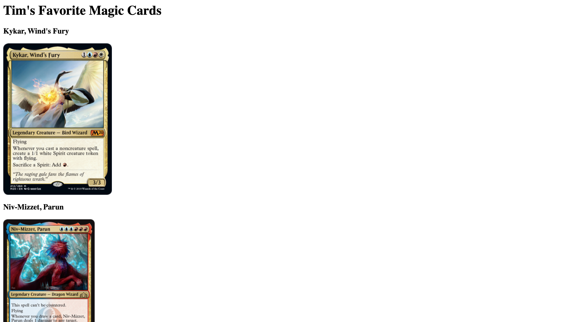
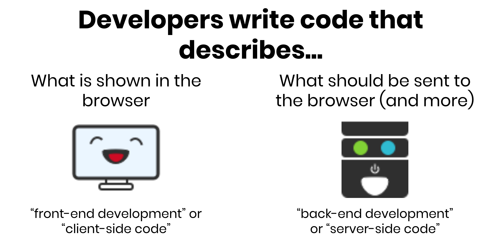
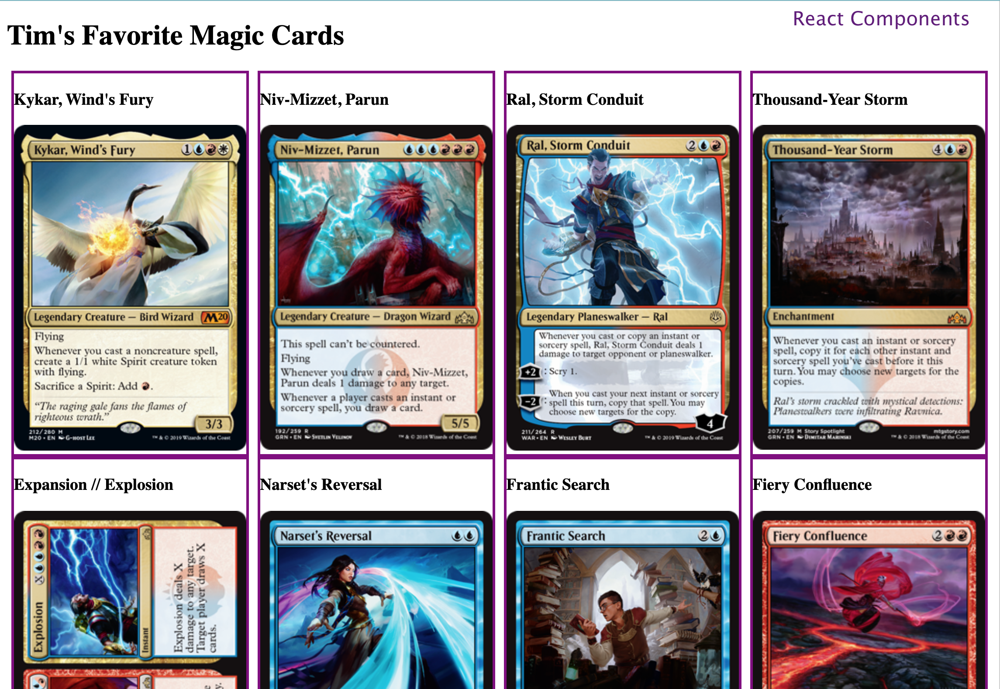

# Hackschool Session 7 Full Stack: Bringing It Together
**Location**: Boelter 5249

**Time**: 6:00–8:00pm, November 20, 2019.

**Teachers**: Kristie Lim and Timothy Rediehs

## Resources

**Slides**
* [Session 7 Full Stack](tinyurl.com/hackschool19-w8)

**ACM Membership Attendance Portal**
* [Portal](https://members.uclaacm.com/login)

## An Overview of This Session
This session will be different then usual.  We won't be teaching from the start of the session. This session is about doing! By the end everyone will have made their own page that 

## What we'll be learning today

* Review of...
  * HTML (Front end)
  * Styling (Front end)
  * How to serve a page (Back End)
  * React (Front end)
  * How to serve data (Back End)
* Then we're going to make `fetch()` happen
  * That's so `fetch()`!

## HTML
The basis for a lot of web development is HTML. Before we do anything, we need a page.
### Objective
Try creating a static html page.  It doesn't need to be fancy.  Make it about something you care about!  I did mine on Magic: The Gathering<sup>TM</sup> cards.  Try to put something on your page that can be repeated later (for me, it was Magic cards).



### Tips
* `<div>` tags seem kind of weird, but they're great for clumping a group of elements together (in my case, it was a card's name and image inside a `div`)

## CSS
The one who wins is the one with the most *style*.  Styling is essential for any webpage.

### Objective
Add some style to your page. I suggest you call your stylesheet style.css  Mine looked like this:


### Tips
* Here's a link to our [CSS workshop](https://github.com/uclaacm/hackschool-f19/tree/master/session-4-css-layout)
* If you have a collection of things, `flexbox` is really nice.
  * Remember!  You make the *container* of all of your stuff (MTG cards in my example) into flexbox! Not each card.

## Order Up! Serve Your Page!

What we have been doing so far is all front end. We used HTML to build the structure of our page and CSS to define the style. Now we want to create a back end to serve our page and, eventually, store information.

### Objective
Create an endpoint `GET '/'` that serves the page you created

### Tips
* [Our intro to backend session](https://github.com/uclaacm/hackschool-f19/tree/master/session-2-intro-to-backend)
* Some setup for you
  * Create a file index.js in the folder with your html file
  * Open your command line and go to that folder
  * Type `npm init -y` and press enter
    * the `-y` option makes it so you don't have to press enter for all of npm's questions
  * Type `npm install express` and press enter
* Remember to start your your server with `app.listen`!
* <kbd>CTRL</kbd> + <kbd>C</kbd> to exit!

### A Speed Bump: Where Did the Styling Go?
If you've gotten this far, you may realize that your styles don't show up! This is because your server never sent them. No one ever told it to. We can fix that.

First, we need to have a way for our front end to ask the server for the stylesheet.  Sounds like a job for an endpoint! Create a `GET '/style.css'` endpoint that responds by serving your stylesheet (style.css). This is very similar to the previous endpoint

Change the `link` tag in your html file so that your have:
```
<link rel = "stylesheet" href = "http://localhost:3000/style.css">
```
This makes your HTML page ask the server for the stylesheet instead of looking for it in your computer's files.

## React
If we want to define new types of 'elements' – which we'll call components – to reuse them, React is very handy.  In this section, we want to use React to create a reusable component for part of your page.
### Objective
Create a react component that takes in at least one prop and use that component at least twice on your page.  In my example, my component had the name of my card and a picture of it.



### Tips
* [Our React workshop]()
* I suggest making an 'App' component for everything and a smaller component that you will reuse in your page
* Our React component shouldn't need too many bells and whistles.  We can just use a `class` that `extends React.Component`.  You'll want a `render()` function that `return`s the jsx (which is like html with some javascript) that makes up your 'element'.  
* `render()` can only return one element, so you can wrap your html like so: `<>YOUR_HTML</>` or like so `<div>YOUR_HTML</div>`

## Serving Data
What makes webpages very cool is the ability to get data from the backend. There are to parts to getting data from the server.  The server must provide a way (endpoint) to request the data, and the client must ask for it (`fetch`).

### Objective
Let's do half of the job. Try creating an enpoint that returns an array of objects that you create on your backend.  For now, it will return the same list every time.  You can create it globally (outside of any methods at the top of your file).  The objects should be relevant to your page!  Here's an example that I used.
```js
const cards = [
    {
        name:"Kykar, Wind's Fury", 
        url: "https://gatherer.wizards.com/Handlers/Image.ashx?multiverseid=466966&type=card"
    },
    {
        name:"Niv-Mizzet, Parun", 
        url: "https://gatherer.wizards.com/Handlers/Image.ashx?multiverseid=452942&type=card"
    }
]
    
```

### Tips
* Use `res.json(*your array/json*)`
* Remember `app.use(express.json());` at the top of your code

## Fetch: Sending and Requesting Data
